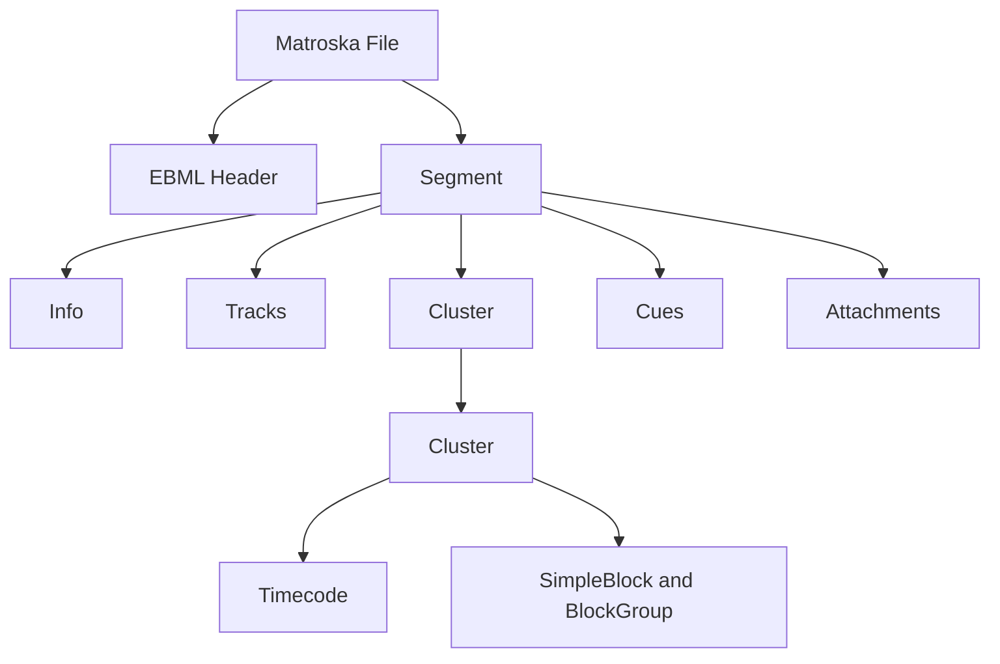
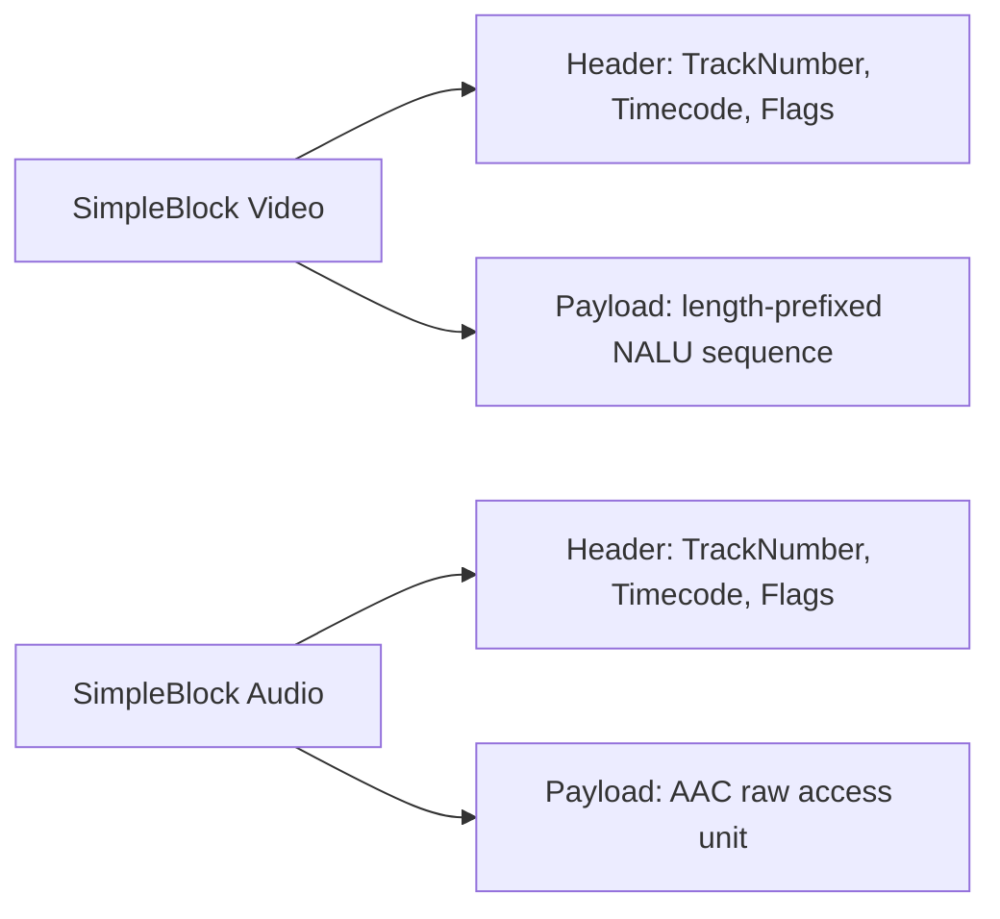
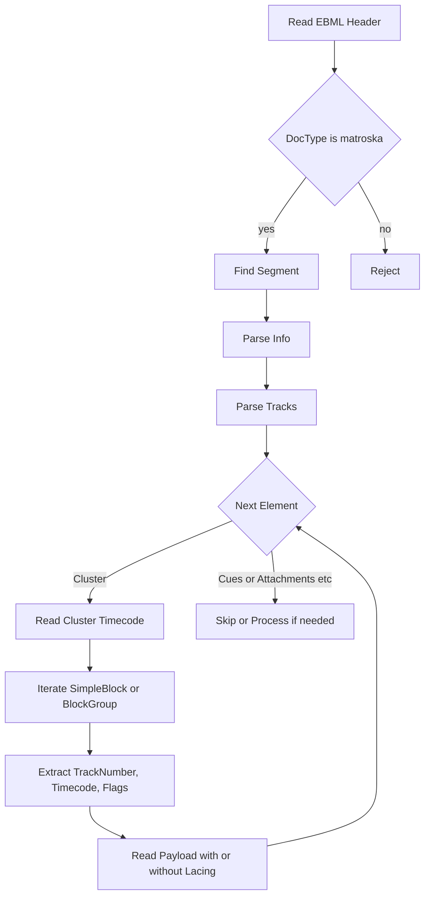
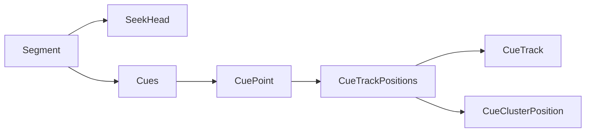
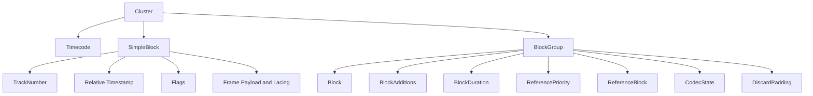
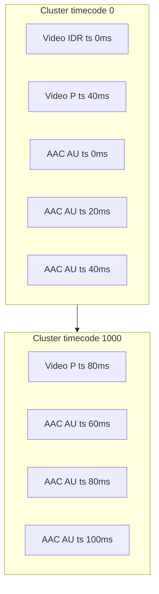
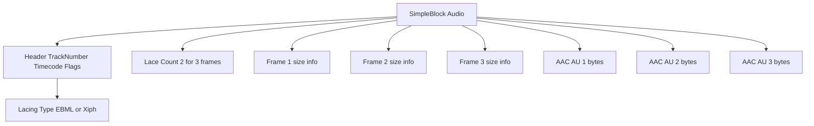
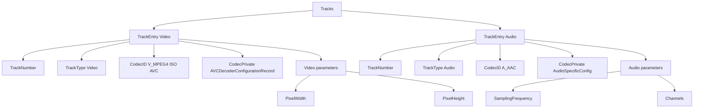
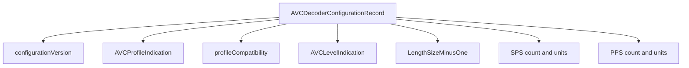
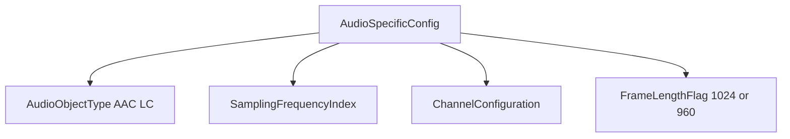

# Matroska (MKV) 格式解析简介（协议参考）

本文档仅作为 Matroska (MKV) 容器与 EBML 协议参考，描述结构与关键元素，不涉及任何实现或设计细节。

## 目录

- [概述](#概述)
- [EBML 基础](#ebml-基础)
- [文件顶层结构](#文件顶层结构)
- [关键元素说明](#关键元素说明)
- [SimpleBlock 总览](#simpleblock-总览)
  - [SimpleBlock 格式](#simpleblock-格式)
  - [SimpleBlock 标志位概览](#simpleblock-标志位概览)
  - [时间戳计算](#时间戳计算)
  - [Block 结构示意](#block-结构示意)
- [EBML 变长整数编码示意](#ebml-变长整数编码示意)
- [协议级解析流程示意](#协议级解析流程示意)
- [Cues 与 SeekHead 概览](#cues-与-seekhead-概览)
- [Cluster 内部结构示意](#cluster-内部结构示意)
- [示例 H264 + AAC 封装存储](#示例-h264--aac-封装存储)
  - [时间线与 Cluster](#时间线与-cluster)
  - [视频负载 H264](#视频负载-h264)
  - [音频负载 AAC](#音频负载-aac)
  - [音频 Lacing 合并](#音频-lacing-合并)
- [Tracks 与 CodecPrivate 示例结构图](#tracks-与-codecprivate-示例结构图)
  - [AVCDecoderConfigurationRecord 概览](#avcdecoderconfigurationrecord-结构概览)
  - [AudioSpecificConfig 概览](#audiospecificconfig-结构概览)
- [参考](#参考)

## 概述

- Matroska 基于 EBML (Extensible Binary Meta Language)。
- EBML 元素由 `ElementID`、`ElementSize`、`ElementData` 构成，前两者为变长整数（VINT）。
- MKV 文件通常为：`EBML Header` + 一个或多个 `Segment`，媒体数据位于 `Segment` 中。

## EBML 基础

- 元素头：
  - `ElementID`：VINT，标识元素类型（不同于 Size 的编码空间）。
  - `ElementSize`：VINT，表示 `ElementData` 字节长度（清除前导长度标志后得到数值）。
- VINT 长度规则（简化）：
  - 前导第一个 `1` 的位置决定总字节数：`1xxxxxxx` 为 1 字节，`01xxxxxx xxxxxxxx` 为 2 字节，依此类推。

## 文件顶层结构

```txt
Matroska File
├─ EBML Header
└─ Segment
   ├─ Info
   ├─ Tracks
   ├─ Cluster (重复出现)
   │  ├─ Timecode
   │  ├─ SimpleBlock / BlockGroup
   ├─ Cues（可选）
   └─ Attachments（可选）
```



## 关键元素说明

- Info（`0x1549A966`）
  - `TimecodeScale`：时间刻度（通常 `1000000` 纳秒）。
  - `Duration`：时长（可选，单位为秒）。
- Tracks（`0x1654AE6B`）
  - 包含多个 `TrackEntry`（`0xAE`）。
  - 常见子元素：`TrackNumber`（`0xD7`）、`TrackType`（`0x83`，视频/音频）、`CodecID`（`0x86`）、`CodecPrivate`（`0x63A2`）。
  - 音频：`Audio`（`0xE1`）含 `Channels`（`0x9F`）、`SamplingFrequency`（`0xB5`）。
  - 视频：`Video`（`0xE0`）含 `PixelWidth`（`0xB0`）、`PixelHeight`（`0xBA`）。
- Cluster（`0x1F43B675`）
  - `Timecode`（`0xE7`）：集群基准时间（相对值，乘 `TimecodeScale` 得纳秒）。
  - `SimpleBlock`（`0xA3`）或 `BlockGroup`（`0xA0`）：承载媒体帧。

## SimpleBlock 总览

### SimpleBlock 格式

- 简化结构：
  - `TrackNumber`：VINT。
  - `Timecode`：有符号 16 位整数（相对 Cluster Timecode）。
  - `Flags`：8 位，含关键帧、不可见、是否使用 Lacing 等。
  - `Payload`：帧数据（若启用 Lacing，包含多个子帧）。
- Lacing 类型：
  - `0` 无 Lacing；`1` Xiph Lacing；`2` Fixed-size Lacing；`3` EBML Lacing。

### SimpleBlock 标志位概览

- 位置：`SimpleBlock` 头部第 3 字节（在 `TrackNumber` 与 2 字节 `Timecode` 之后）。
- 语义说明：Keyframe（RAP 标记）、Invisible（不可见）、Lacing（类型）、Discardable（可丢弃）。
- 注：不同资料对位编号的说明存在差异，请以官方规范为准并统一实现约定。
- 参考：Matroska 规范说明（Flags 与 RAP 关系、Lacing 要求）。
  - <https://www.matroska.org/technical/notes.html>

### 时间戳计算

- 帧时间戳（纳秒）：`timestamp_ns = cluster_timecode_ns + simpleblock_timecode * TimecodeScale`
- 若存在 `DefaultDuration`（`0x23E383`），可估计逐帧间隔与显示时间。

### Block 结构示意



## EBML 变长整数编码示意

```txt
Byte:  [b7 b6 b5 b4 b3 b2 b1 b0]
Rule:  Leading 1 determines total length in bytes.
Ex:    1xxxxxxx  -> length = 1
       01xxxxxx xxxxxxxx -> length = 2
       001xxxxx xxxxxxxx xxxxxxxx -> length = 3

ElementSize value is computed with leading-length marker bits cleared.
ElementID follows similar length rules but has its own ID space.
```

## 协议级解析流程示意



## Cues 与 SeekHead 概览



- `SeekHead`：顶层元素位置索引（例如 `Info`、`Tracks`、`Cues` 的偏移）。
- `Cues`：为某轨道提供跳转点映射到 `Cluster` 的位置。

## Cluster 内部结构示意



## 示例 H264 + AAC 封装存储

以下示例仅用于说明在 MKV 中同时封装 H264 视频与 AAC 音频的常见布局与负载结构。为简化说明，示例采用英文标签且不涉及实现细节。

- Tracks 概览：
  - Video Track: `CodecID` V_MPEG4/ISO/AVC，`CodecPrivate` 携带 SPS PPS 等解码配置。
  - Audio Track: `CodecID` A_AAC，`CodecPrivate` 为 AudioSpecificConfig（采样率、声道、帧长等）。
  - 假设：视频 25 fps；音频 48 kHz，AAC-LC 20 ms 帧（960 samples）；`TimecodeScale` 1000000 ns。



- 映射关系说明：
  - Video 的每个帧（IDR 或 P）对应一个 `SimpleBlock`，`Flags` 标记关键帧与可见性；时间戳为相对 `Cluster Timecode`。
  - Audio 的每个 AAC AU（约 20 ms）对应一个 `SimpleBlock`；若轨道设置了 `DefaultDuration`，可不在块上单独标注 `BlockDuration`。

### 时间线与 Cluster

- `timestamp_ns = cluster_timecode_ns + simpleblock_timecode * TimecodeScale`。
- `Cues` 可为视频轨提供关键帧索引，实现快速跳转到对应 `Cluster` 位置。

### 视频负载 H264

Video `SimpleBlock` Payload 常见为 Length‑prefixed NALU 序列（非 Annex B 起始码）：

```txt
// Video SimpleBlock payload (length-prefixed NALU)
[uint32 length][SPS]
[uint32 length][PPS]
[uint32 length][IDR slice]
... // additional slices or SEI as present
```

- 关键帧通常包含 SPS PPS 与 IDR；非关键帧包含 P/B slices 等。
- `CodecPrivate` 中的配置用于初始化解码器（NALU 长度字节数、SPS/PPS 集合等）。

### 音频负载 AAC

Audio `SimpleBlock` Payload 为 AAC Raw Access Unit（无 ADTS/ADIF 头）：

```txt
// Audio SimpleBlock payload (AAC raw AU)
[aac frame bytes for 960 samples at 48kHz]
```

- 每个 AU 约 20 ms（48kHz × 0.02s ≈ 960 samples）。
- `CodecPrivate` 的 AudioSpecificConfig 描述 Profile、Sample Rate、Channels 与 Frame Length Flag。

### 音频 Lacing 合并

当启用 Lacing 时，可将多个 AAC AU 合并在一个 `SimpleBlock` 中以降低头部开销。以下示例展示合并 3 个约 20 ms 的 AAC 帧：



字节布局（概念化，EBML Lacing 与 Xiph Lacing 的大小字段编码不同）：

```txt
// SimpleBlock (audio, laced) conceptual layout
[TrackNumber (VINT)]
[Timecode (int16)]
[Flags (bit8, LacingType != 0)]
[LaceCount (uint8) = 2] // for 3 frames; value = frames - 1
// EBML Lacing: first size = VINT, following sizes are signed deltas (VINT)
[Size1 VINT][DeltaSize2 VINT][DeltaSize3 VINT]
[Frame1 bytes][Frame2 bytes][Frame3 bytes]
```

提示：固定大小 Lacing（Fixed-size）不携带大小表；Xiph Lacing 使用可变长度字节串累加表示各帧大小。实现时需严格遵循 Matroska 规范对应的编码方式。

## Tracks 与 CodecPrivate 示例结构图

以下示意图展示 `Tracks` 中视频轨与音频轨的常见字段，以及对应 `CodecPrivate` 的结构要点。标签使用英文以增强 Mermaid 解析兼容性。



### AVCDecoderConfigurationRecord 结构概览



- `LengthSizeMinusOne` 决定 NALU 长度前缀字节数（常见为 4 字节长度前缀）。
- `SPS count and units` 与 `PPS count and units` 为打包在 `CodecPrivate` 中的参数集合。

### AudioSpecificConfig 结构概览



- `AudioObjectType AAC LC` 为常见配置，示例中每帧约 20ms（960 samples）。
- `FrameLengthFlag` 指示 AAC 帧长度选项，常见为 1024 或 960 采样。

## 参考

- Matroska 官方文档：<https://www.matroska.org/>
- EBML 规范：<https://datatracker.ietf.org/doc/html/rfc8794>
